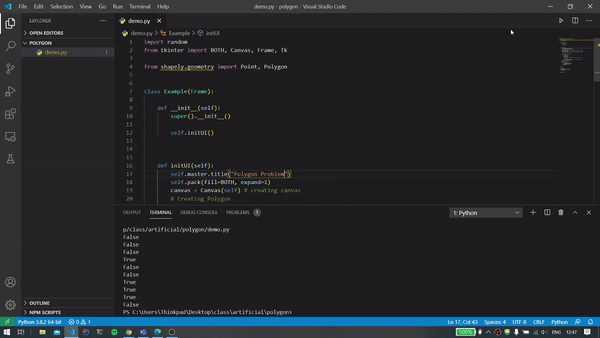

# Point in a polygon

This is a school project that randomly creates points and calculates if a point is inside or outside of a polygon

# Demonstration



## Requirements

Use the package manager [pip](https://pip.pypa.io/en/stable/) to install shapely and tkinter.

```bash
pip install shapely
pip install tkinter
```

## Contributing
Pull requests are welcome. For major changes, please open an issue first to discuss what you would like to change.

Please make sure to update tests as appropriate.

## License
[MIT](https://choosealicense.com/licenses/mit/)